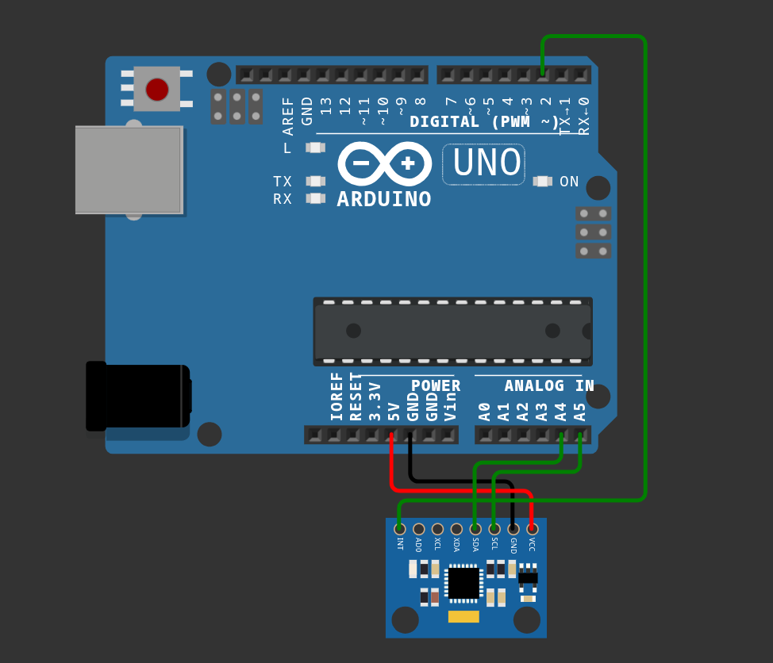

<h1 align="center"> MPU6050 OOF Detector</h1>

<p align="center">
  
  
  
  
</p>

A compact motion-detection project built around an Arduino Uno and MPU6050 IMU. Sensor data is transmitted to a Python application over USB, where acceleration magnitude is calculated and used to trigger audio playback when a high-impact movement is detected.

# Technical Specifications

࿔ Hardware:

**Microcontroller:** Arduino Uno

**IMU:** MPU6050 3-axis accelerometer + 3-axis gyroscope

**Communication:** USB Serial / 115200 baud

**Interface:** I²C

### MPU6050 → Arduino Uno

| MPU6050 | Arduino Uno |
| :------ | :---------- |
| VCC     | 5V          |
| GND     | GND         |
| SDA     | A4          |
| SCL     | A5          |

࿔ Software:

**Firmware:** C++ / PlatformIO

**Sensor Library:** Adafruit MPU6050

**Sensor Framework:** Adafruit Unified Sensor

**Communication:** PySerial

**Data Processing:** Python

**Audio Playback:** mpv

# ⚙️ Detection System

The MPU6050 continuously provides acceleration values along the three axes.

Python calculates the acceleration magnitude using:

```text
√(X² + Y² + Z²)
```

The resulting magnitude is compared against a configurable threshold. When the threshold is exceeded, the audio trigger is activated.

A cooldown is applied after activation to prevent repeated triggers from a single movement.

# 📁 Repository Map

├── `main.cpp`

├── `test.py`

├── `platformio.ini`

├── `OOF.mp3`

└── `README.md`

# Overview

### ★ Hardware Setup

MPU6050 connected to the Arduino Uno through the I²C interface.

### ★ Serial Data

The Arduino transmits sensor readings in the following format:

```text
X,Y,Z
```

Example:

```text
0.85,5.18,8.46
```

### ★ Wiring


